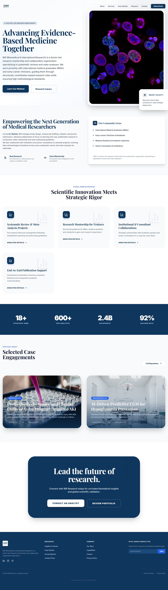

# BIR — Biomedical & International Research (Corporate Platform)

Production-grade corporate website + admin console with a secure backend API, global CMS persistence, and CI/CD to Google Cloud Run.

**Live:** https://birresearch.com/

---

## What I built (high-impact summary)

This repository is a complete full-stack deployment with:

- A modern React + Vite corporate website
- An admin console for editing site content (CMS)
- A Node/Express backend that persists CMS data globally via Firestore
- A secure proxy endpoint so sensitive API keys never ship to the browser
- Automated CI/CD: GitHub → Artifact Registry → Cloud Run
- Production routing via Cloudflare (Pages + Worker route)

---

## Screenshots



---

## Key features

### Frontend

- Multi-page marketing site (React Router)
- Responsive UI + modern component structure


### Backend API

- `GET /api/cms` — fetch global CMS JSON
- `PUT /api/cms` — save CMS JSON (admin-auth required)
- `POST /api/admin/login` — sets HttpOnly session cookie
- `POST /api/admin/logout` — clears session cookie
- `POST /api/gemini-proxy` — server-side proxy to protect API keys
- Health endpoints for Cloud Run (`/` → OK, `/healthz` → JSON)

### Data persistence

- Uses Firestore document: `site/cmsData`
- Supports Cloud Run ADC (Application Default Credentials) so no service account JSON is required in production

### Security & hardening

- Secrets never embedded into frontend builds
- Admin writes require authenticated session (cookie-based) or an explicit token header (optional automation)
- Rate limiting + request logging on the backend

---

## Architecture

```text
Browser
   |  https://birresearch.com
   |  fetch('/api/...')
   v
Cloudflare Pages  (frontend)
   |
   | Worker Route: birresearch.com/api/*
   v
Cloudflare Worker (proxy)
   |
   v
Google Cloud Run  (Express API)
   |
   v
Firestore (CMS persistence)
```

Why this setup works well:

- Same-origin API (`/api/*`) makes cookies/CORS easy
- Firestore provides global persistence and durability
- Cloud Run simplifies secure backend hosting with server-side secrets

---

## Local development

**Prerequisites**

- Node.js 20+ recommended (the Docker build uses Node 22)

### Install

```bash
npm install
```

### Run backend (API)

```bash
npm run start:server
```

### Run frontend

```bash
npm run dev
```

Vite dev proxy forwards `/api/*` to your local server.

---

## Environment variables

### Frontend (Cloudflare Pages)

> Any `VITE_*` variable is public (baked into the JS bundle).

- `VITE_ADMIN_PASSWORD` — client-side gate for the admin UI (not true security)

### Backend (Cloud Run)

- `ADMIN_PASSWORD` — used for `POST /api/admin/login`
- `SESSION_SECRET` — signs session cookies
- `ADMIN_API_TOKEN` — optional header-based auth for automation/worker usage
- `GEMINI_API_KEY` + `GEMINI_API_URL` — for `/api/gemini-proxy`

---

## Deployment pipeline (CI/CD)

Backend pipeline:

1. Push to `main`
2. GitHub Actions builds Docker image
3. Pushes to Artifact Registry
4. Deploys new revision to Cloud Run

Frontend pipeline:

1. Push to `main`
2. Cloudflare Pages builds `npm run build`
3. Publishes `dist/`

Full operational documentation:

- [docs/DEPLOYMENT.md](docs/DEPLOYMENT.md)

---

## Operational checklist

- Seed CMS once after first deploy (creates `site/cmsData`): log in to admin and “Sync to Server”.
- Verify global persistence: open the site in Incognito and confirm changes are visible.
- Rotate passwords and secrets if they are ever exposed.

---

## Tech stack

- React + TypeScript + Vite
- Express (Node.js)
- Firestore (`firebase-admin`)
- Cloudflare Pages + Worker routes
- Google Cloud Run + Artifact Registry

---

## Links

- Live site: https://birresearch.com/


